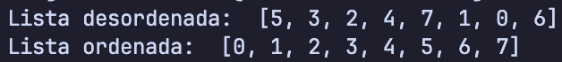

# Bubble Sort

Bubble Sort é um algoritmo de ordenação simples que percorre a lista várias vezes, comparando elementos adjacentes e trocando-os se estiverem na ordem errada. Este processo é repetido até que a lista esteja ordenada.

## Implementações

Neste repositório, temos duas implementações do algoritmo Bubble Sort:

1. **Bubble Sort Original**: Esta é a implementação básica do algoritmo.
2. **Bubble Sort Otimizado**: Esta versão inclui uma otimização que interrompe o algoritmo se a lista já estiver ordenada antes de completar todas as iterações.

### Bubble Sort Original

O arquivo `bubblesort.py` contém a implementação básica do Bubble Sort. Ele percorre a lista várias vezes, trocando elementos adjacentes que estão fora de ordem.

```python
def bubble_sort(unsorted_items):
    item_count = len(unsorted_items)

    for i in range(item_count - 1):
        for j in range(item_count - 1 - i):
            if unsorted_items[j] > unsorted_items[j + 1]:
                unsorted_items[j], unsorted_items[j + 1] = unsorted_items[j + 1], unsorted_items[j]
```

### Bubble Sort Otimizado

O arquivo `optimized_bubblesort.py` contém uma versão otimizada do Bubble Sort. Esta implementação inclui uma verificação para determinar se a lista já está ordenada, o que pode reduzir significativamente o número de iterações necessárias.

```python
def optimized_bubble_sort(unsorted_items):
    item_count = len(unsorted_items)

    for i in range(item_count - 1):
        swapped = False

        for j in range(item_count - 1 - i):
            if unsorted_items[j] > unsorted_items[j + 1]:
                unsorted_items[j], unsorted_items[j + 1] = unsorted_items[j + 1], unsorted_items[j]
                swapped = True

        if not swapped:
            break
```

## Instruções de Execução

### Executando o Algoritmo

Para executar o algoritmo Bubble Sort, você pode usar o arquivo `test.py`. Este arquivo contém um exemplo de uso do algoritmo.

```sh
python bubble_sort/test.py
```

### Executando o Teste de Performance

Para executar o teste de performance das duas implementações, use o arquivo `perf_test.py` localizado na pasta `perf_test`.

```sh
python bubble_sort/perf_test/perf_test.py
```

## Exemplo de Execução

Abaixo está uma imagem ilustrando a execução do algoritmo, mostrando o array antes e depois da ordenação:



## Testes de Performance

O arquivo `perf_test.py` contém um script para testar a performance das duas implementações. Ele gera listas de tamanhos diferentes e mede o tempo necessário para ordená-las usando ambas as versões do Bubble Sort.

```python
import time
import random

from unoptimized_bubblesort import unoptimized_bubble_sort
from optimized_bubblesort import optimized_bubble_sort

sizes = [100, 1000, 10000]

for size in sizes:
    array = random.sample(range(size * 10), size)

    array_copy = array.copy()
    start_time = time.time()
    unoptimized_iterations = unoptimized_bubble_sort(array_copy)
    end_time = time.time()
    unoptimized_time = end_time - start_time

    array_copy = array.copy()
    start_time = time.time()
    optimized_iterations = optimized_bubble_sort(array_copy)
    end_time = time.time()
    optimized_time = end_time - start_time

    print(f"{'Quantidade':<15}{'Original (s)':<15}{'Iterações (Original)':<25}{'Otimizado (s)':<15}{'Iterações (Otimizado)':<25}")
    print(f"{size:<15}{unoptimized_time:<15.6f}{unoptimized_iterations:<25}{optimized_time:<15.6f}{optimized_iterations:<25}")
    print()
```

## Comparação de Performance

Abaixo está uma comparação de performance entre as duas implementações do Bubble Sort.

| Tamanho da Lista | Iterações (Original) | Iterações (Otimizado) | Tempo de Execução (Original) | Tempo de Execução (Otimizado) |
| ---------------- | -------------------- | --------------------- | ---------------------------- | ----------------------------- |
| 100              | 4950                 | 4944                  | 0.000432s                    | 0.000438s                     |
| 1000             | 499500               | 496179                | 0.040705s                    | 0.035139s                     |
| 10000            | 49995000             | 49985130              | 3.885419s                    | 4.208046s                     |

[Resultado do teste de performance](./images/perf_test_result.png)

### Análise dos Resultados

A otimização do Bubble Sort melhora o desempenho, especialmente em listas parcialmente ordenadas. Sua principal vantagem é interromper a ordenação assim que a lista estiver organizada, evitando processamento desnecessário.

Para avaliar essa melhoria, realizamos testes com listas de 100, 1000 e 10.000 elementos, comparando a versão original e a otimizada. Embora o tempo de execução da versão otimizada nem sempre seja menor, ela reduz significativamente o número de iterações, tornando o algoritmo mais eficiente. Em listas pequenas, a diferença no tempo de execução é mínima, mas, à medida que o tamanho da lista aumenta, a otimização se torna mais vantajosa.

Como utilizamos números aleatórios nos testes, a versão otimizada não apresentou um grande impacto, já que seu desempenho é mais evidente quando há um certo grau de ordenação prévia. Ainda assim, trata-se de uma melhoria simples e eficaz, capaz de reduzir o número de iterações e otimizar o processamento em situações adequadas.
