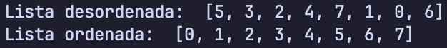

# Selection Sort

Selection Sort é um algoritmo de ordenação simples que percorre a lista várias vezes, selecionando o menor elemento e trocando-o com o primeiro elemento não ordenado. Este processo é repetido até que a lista esteja ordenada.

## Implementações

Neste repositório, temos duas implementações do algoritmo Selection Sort:

1. **Selection Sort Original**: Esta é a implementação básica do algoritmo.
2. **Selection Sort Otimizado**: Esta versão inclui uma otimização que evita trocas desnecessárias.

### Selection Sort Original

O arquivo `selection_sort.py` contém a implementação básica do Selection Sort. Ele percorre a lista várias vezes, selecionando o menor elemento e trocando-o com o primeiro elemento não ordenado.

```python
def selection_sort(unsorted_items):
    item_count = len(unsorted_items)

    for i in range(item_count - 1):
        position = i

        for j in range(i + 1, item_count):
            if unsorted_items[j] < unsorted_items[position]:
                position = j

        unsorted_items[i], unsorted_items[position] = unsorted_items[position], unsorted_items[i]
```

### Selection Sort Otimizado

O arquivo `optimized_selection_sort.py` contém uma versão otimizada do Selection Sort. Esta implementação inclui uma verificação para evitar trocas desnecessárias.

```python
def optimized_selection_sort(unsorted_items):
    item_count = len(unsorted_items)

    for i in range(item_count - 1):
        position = i

        for j in range(i + 1, item_count):
            if unsorted_items[j] < unsorted_items[position]:
                position = j

        if position != i:
            unsorted_items[i], unsorted_items[position] = unsorted_items[position], unsorted_items[i]
```

## Instruções de Execução

### Executando o Algoritmo

Para executar o algoritmo Selection Sort, você pode usar o arquivo `test.py`. Este arquivo contém um exemplo de uso do algoritmo.

```sh
python selection_sort/test.py
```

### Executando o Teste de Performance

Para executar o teste de performance das duas implementações, use o arquivo `perf_test.py` localizado na pasta `perf_test`.

```sh
python selection_sort/perf_test/perf_test.py
```

## Exemplo de Execução

Abaixo está uma imagem ilustrando a execução do algoritmo, mostrando o array antes e depois da ordenação:



## Testes de Performance

O arquivo `perf_test.py` contém um script para testar a performance das duas implementações. Ele gera listas de tamanhos diferentes e mede o tempo necessário para ordená-las usando ambas as versões do Selection Sort.

```python
import time
import random

from unoptimized_selection_sort import unoptimized_selection_sort
from optimized_selection_sort import optimized_selection_sort

sizes = [100, 1000, 10000]

for size in sizes:
    array = random.sample(range(size * 10), size)

    array_copy = array.copy()
    start_time = time.time()
    unoptimized_iterations = unoptimized_selection_sort(array_copy)
    end_time = time.time()
    unoptimized_time = end_time - start_time

    array_copy = array.copy()
    start_time = time.time()
    optimized_iterations = optimized_selection_sort(array_copy)
    end_time = time.time()
    optimized_time = end_time - start_time

    print(f"{'Quantidade':<15}{'Original (s)':<15}{'Iterações (Original)':<25}{'Otimizado (s)':<15}{'Iterações (Otimizado)':<25}")
    print(f"{size:<15}{unoptimized_time:<15.6f}{unoptimized_iterations:<25}{optimized_time:<15.6f}{optimized_iterations:<25}")
    print()
```

## Comparação de Performance

Abaixo está uma comparação de performance entre as duas implementações do Selection Sort.

| Tamanho da Lista | Iterações (Original) | Iterações (Otimizado) | Tempo de Execução (Original) | Tempo de Execução (Otimizado) |
| ---------------- | -------------------- | --------------------- | ---------------------------- | ----------------------------- |
| 100              | 4950                 | 4950                  | 0.000235s                    | 0.000234s                     |
| 1000             | 499500               | 404234                | 0.023775s                    | 0.017111s                     |
| 10000            | 49995000             | 37869650              | 2.135082s                    | 1.616763s                     |

[Resultado do teste de performance](./images/perf_test_result.png)

### Análise dos Resultados

Os resultados dos testes de performance mostram que a otimização do Selection Sort melhora o desempenho, especialmente em listas maiores. A principal vantagem da versão otimizada é a redução significativa no número de iterações, o que torna o algoritmo mais eficiente.

Para avaliar essa melhoria, realizamos testes com listas de 100, 1000 e 10.000 elementos, comparando a versão original e a otimizada. Observamos que, embora o tempo de execução da versão otimizada nem sempre seja drasticamente menor, ela reduz significativamente o número de iterações, especialmente em listas maiores. Em listas pequenas, a diferença no tempo de execução é mínima, mas, à medida que o tamanho da lista aumenta, a otimização se torna mais vantajosa.

Os testes indicam que a versão otimizada é mais eficiente em termos de iterações, o que pode levar a uma melhor performance em cenários com listas grandes ou parcialmente ordenadas. Mesmo que a diferença no tempo de execução não seja sempre significativa, a redução no número de iterações é um indicativo claro da eficiência da otimização.
